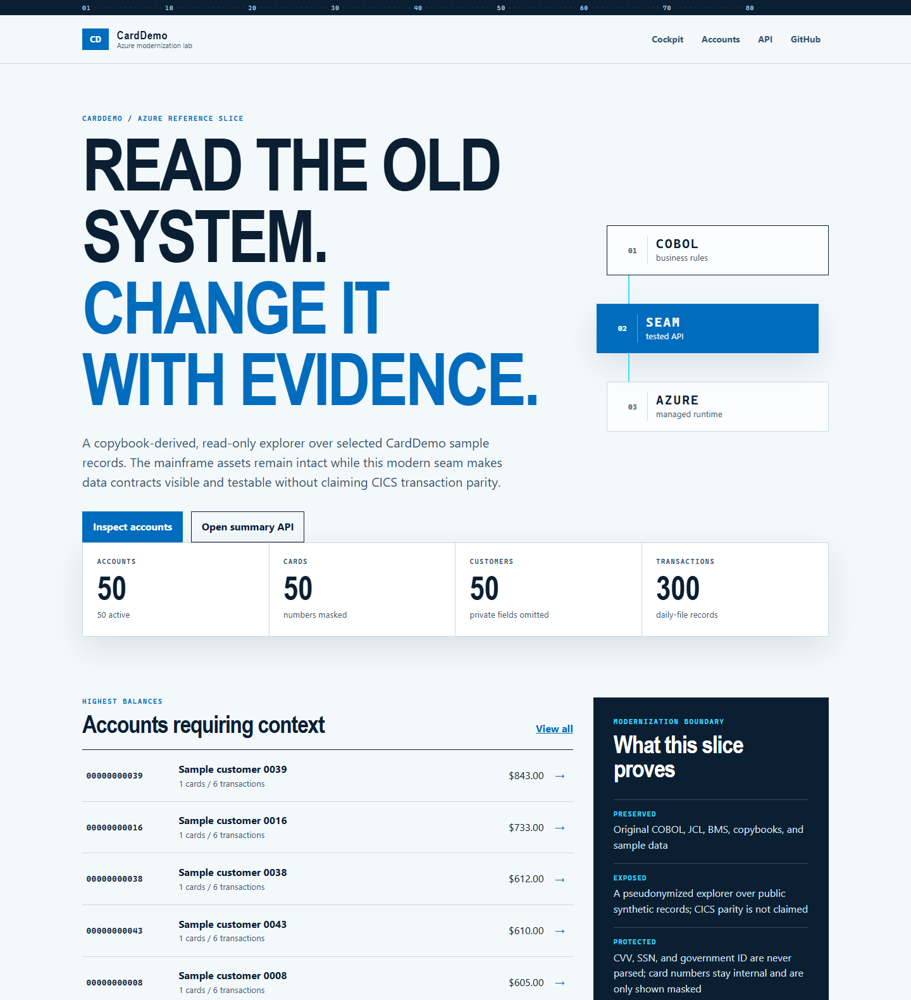
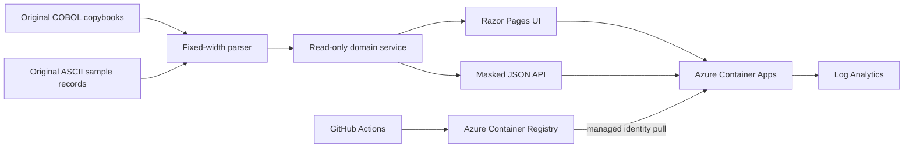

# CardDemo Azure modernization lab

[](https://github.com/xavierxmorris/azure-mainframe-modernization-carddemo/actions/workflows/ci.yml)
[](https://github.com/xavierxmorris/azure-mainframe-modernization-carddemo/actions/workflows/codeql.yml)
[](LICENSE)
[](https://dotnet.microsoft.com/)
[](https://learn.microsoft.com/azure/container-apps/)

An Azure-ready, AI-ready modernization of the
[AWS CardDemo sample](https://github.com/aws-samples/aws-mainframe-modernization-carddemo).
It preserves the original COBOL, CICS, BMS, JCL, VSAM, Db2, IMS, MQ, scheduler,
and sample-data assets while adding a tested ASP.NET Core reference slice,
repeatable Azure deployment, and modern GitHub Copilot workflows.

**Live Azure demo:**
<https://ca-carddemo-xm-dev-5gp7yl.jollysmoke-f0a69d38.australiaeast.azurecontainerapps.io>
(the first request can be slower because the demo scales to zero).



> [!IMPORTANT]
> The modern application is a **read-only reference slice**, not a production
> banking system or a functionally complete rewrite. It is designed to make
> legacy records and migration decisions visible, testable, and reviewable.

## What is better

| Upstream baseline | This repository |
|---|---|
| Mainframe source and fixed-width data only | Runnable web UI and JSON API over the original records |
| Mainframe environment required for meaningful execution | Local .NET, Docker, and Azure Container Apps paths |
| Manual interpretation of copybooks | Tested copybook offsets and COBOL signed-overpunch parsing |
| Sample credentials and sensitive-shaped fields visible in source data | No sign-in emulation; people are pseudonymized, card numbers are masked, and contact/identity fields are omitted |
| No automated tests or CI | Unit tests, format gate, container smoke tests, Bicep build, CodeQL, Dependabot |
| No cloud infrastructure | Bicep, managed identity, private ACR auth, health probes, autoscaling, Log Analytics |
| Generic contribution guidance | Mainframe-aware pull request, issue, security, and validation guidance |
| No agent context | Copilot instructions, path rules, custom agents, skills, prompts, and cloud-agent setup |
| Broad “rewrite” starting point | Evidence-driven strangler pattern and phased Azure backlog |

## Run locally

Prerequisites:

- [.NET SDK 10](https://dotnet.microsoft.com/download/dotnet/10.0)
- Docker Desktop or another Linux container runtime
- Azure CLI with Bicep for infrastructure validation

```powershell
git clone https://github.com/xavierxmorris/azure-mainframe-modernization-carddemo.git
Set-Location azure-mainframe-modernization-carddemo
.\scripts\validate-modern.ps1
dotnet run --project .\src\CardDemo.Modern
```

Open the URL printed by ASP.NET Core. Useful routes:

| Route | Purpose |
|---|---|
| `/` | Migration cockpit |
| `/Accounts` | Search and browse assembled account views |
| `/Accounts/00000000001` | Account detail example |
| `/api/summary` | Dataset record counts |
| `/api/accounts?q=...` | Pseudonymized account search API |
| `/api/accounts/{id}` | Pseudonymized, masked account detail API |
| `/health` | Container readiness/liveness endpoint |

To run the exact production image locally:

```powershell
docker build --tag carddemo-azure:local .
docker run --rm --publish 8080:8080 carddemo-azure:local
.\scripts\smoke-test.ps1 -BaseUrl http://localhost:8080
```

## Deploy to Azure

The default deployment uses:

- Azure Container Apps consumption environment
- Azure Container Registry Basic
- User-assigned managed identity with `AcrPull`
- Log Analytics with 30-day retention
- HTTPS-only ingress and explicit startup, readiness, and liveness probes
- 0–3 replicas at 0.25 vCPU / 0.5 GiB each

```powershell
az login
.\scripts\deploy-azure.ps1 -EnvironmentName carddemo-xm-dev -Location australiaeast
```

Equivalent direct Azure Developer CLI flow:

```powershell
azd env new carddemo-xm-dev
azd env set AZURE_LOCATION australiaeast
azd up
```

Remove the demo resources when they are no longer required:

```powershell
azd down --purge --force
```

See [Azure migration assessment](docs/azure-migration-assessment.md) for the
current-state inventory, service mappings, risks, and non-goals.
The tested deployment configuration is captured in
[deployment evidence](docs/deployment-evidence.md).

## Architecture



Future production phases replace immutable seed files with Azure SQL or
PostgreSQL, IBM MQ with Azure Service Bus, JCL schedules with Container Apps
Jobs or Durable Functions, and RACF-style sign-in with Microsoft Entra ID.

## Repository map

| Path | Contents |
|---|---|
| `app/` | Preserved COBOL, copybooks, BMS, JCL, CICS definitions, Db2, IMS, MQ, and data |
| `samples/` | Original compile/runtime samples |
| `scripts/*.sh` | Original mainframe helper scripts |
| `src/CardDemo.Modern/` | ASP.NET Core 10 reference application |
| `tests/CardDemo.Modern.Tests/` | Parser, masking, linking, and summary tests |
| `infra/` | Azure subscription/resource-group Bicep |
| `.github/` | CI, security, Copilot customizations, templates, and dependency updates |
| `docs/` | Assessment, decisions, target mappings, Copilot playbook, and backlog |

## GitHub Copilot modernization workflow

This repository uses the current customization layers for different kinds of
context instead of one oversized prompt:

1. `.github/copilot-instructions.md` supplies concise always-on facts.
2. `.github/instructions/*.instructions.md` applies precise rules to legacy,
   .NET, Azure, and workflow files.
3. `.github/agents/*.agent.md` provides analyst, implementer, and reviewer roles.
4. `.github/skills/*/SKILL.md` loads detailed copybook, transaction, and
   validation procedures only when relevant.
5. `.github/prompts/*.prompt.md` provides explicit local slash-command workflows.
6. `.github/workflows/copilot-setup-steps.yml` prepares the cloud agent with
   .NET dependencies and Bicep.

The recommended LLM-assisted loop is:

```text
trace legacy entry point -> extract invariants -> write characterization tests
-> implement one seam -> compare outputs -> review sensitive data -> deploy
-> observe -> decide the next transaction
```

See [Copilot modernization playbook](docs/copilot-modernization-playbook.md).

## Security and data handling

The checked-in records are sample data, but their shapes include card numbers,
CVV-like values, SSNs, government IDs, dates of birth, and contact details.
Treat them as sensitive-shaped data:

- Never log raw fixed-width records.
- Never expose CVV, SSN, or government ID fields.
- Keep card values masked outside the parser.
- Do not reuse sample credentials.
- Use Entra ID and managed identities for future authenticated services.

Report vulnerabilities according to [SECURITY.md](SECURITY.md).

## Upstream and license

This project is derived from
[`aws-samples/aws-mainframe-modernization-carddemo`](https://github.com/aws-samples/aws-mainframe-modernization-carddemo)
at commit `59cc6c2fd7ebd7ef7925cad552a01a4b8b6e4d5e`.
Original copyright notices and the Apache License 2.0 are retained. Historical
`AWS.M2` dataset names remain in legacy source and data to preserve behavioral
and migration traceability; they are not Azure resource names.
